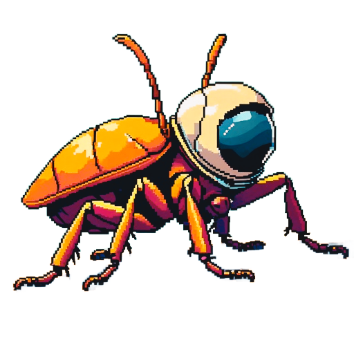
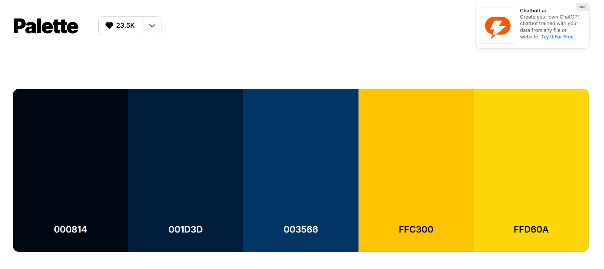
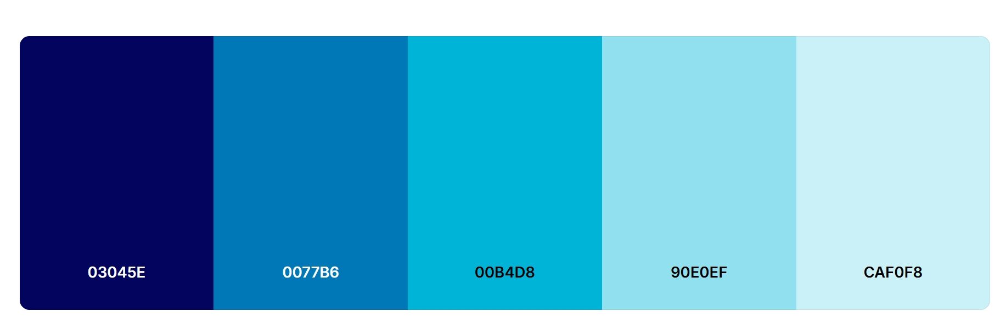
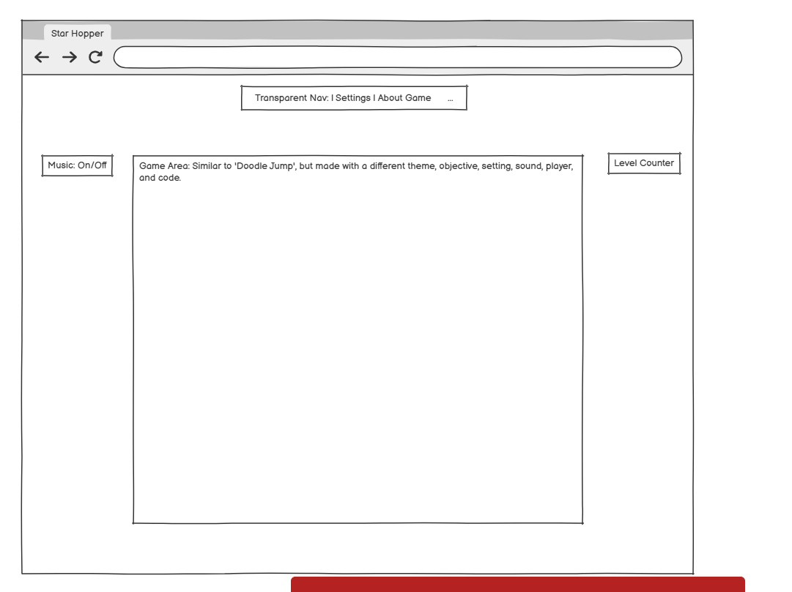
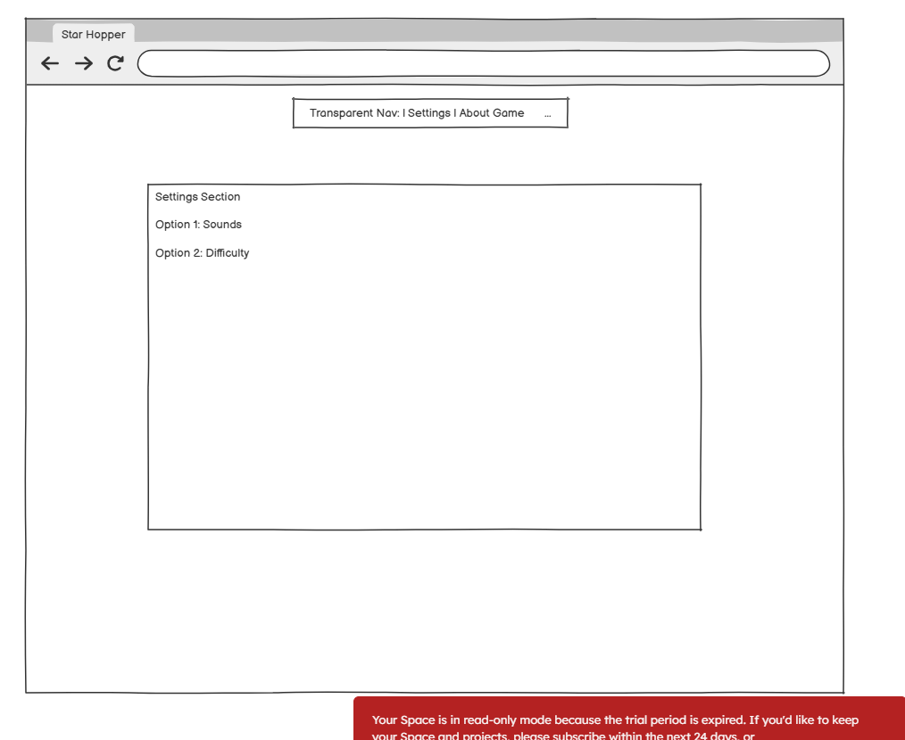
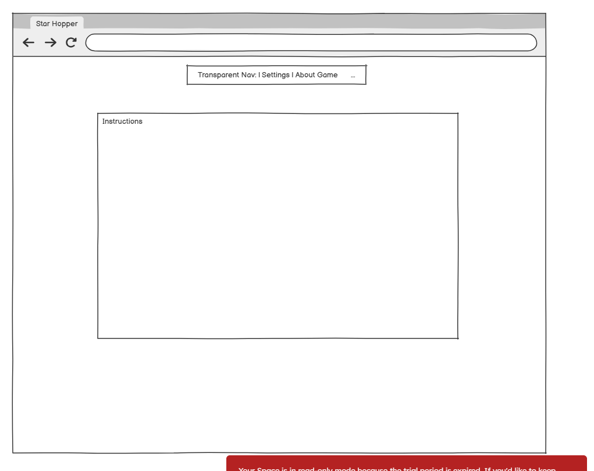

# DESTINATION: MARS

You can find the GitHub deployed site, [here](https://tstyer.github.io/Basic-Game-Destination-Mars/). 

## Table of Contents

- [Introduction](#introduction)
- [Project Overview](#project-overview)
  - [Scope](#scope)
- [User Experience](#user-experience)
  - [Demographics](#demographics)
    - [Target Audience](#target-audience)
    - [Goals](#goals)
  - [Structure](#structure)
  - [User Expectations](#user-expectations)
  - [User Stories](#user-stories)
    - [Target User Goals](#target-user-goals)
    - [New Visitors](#new-visitors)
    - [Returning Visitors](#returning-visitors)
- [Site-Owner Goals](#site-owner-goals)
- [Features](#features)
  - [Space Bug](#space-bug)
  - [Navigation Bar](#navigation-bar)
  - [Score Counter](#score-counter)
  - [Changing Platforms](#changing-platforms)
  - [Interactive Music](#interactive-music)
  - [Settings Page](#settings-page)
- [Design](#design)
  - [Colour Scheme](#colour-scheme)
  - [Typography](#typography)
  - [Images](#images)
  - [Wireframes](#wireframes)
  - [Future Design Plans](#future-design-plans)
- [Technology Use](#technology-use)
- [Folder Structure](#folder-structure)
- [Deployment](#deployment)
  - [To Github Pages](#to-github-pages)
  - [How To Make a Clone](#how-to-make-a-clone)
- [Testing](#testing)
  - [User Stories](#user-stories-1)
  - [HTML Validation](#html-validation)
  - [CSS Validation](#css-validation)
  - [JS Validation](#js-validation)
  - [Lighthouse](#lighthouse)
  - [Manual Testing](#manual-testing)
  - [Responsiveness](#responsiveness)
  - [Browser Compatibility](#browser-compatibility)
- [TDD For JavaScript](#tdd-for-javascript)
- [Bugs](#bugs)
- [Validation Errors](#validation-errors)
- [Image Testing](#image-testing)
- [Credits](#credits)
- [Reflections](#reflections)
  - [What Went Well?](#what-went-well)
    - [HTML and CSS](#html-and-css)
  - [Lessons Learned](#lessons-learned)
    - [JavaScript Logic](#javascript-logic)
    - [Jest](#jest)
  - [Future Considerations](#future-considerations)
    - [Difficulty Settings](#difficulty-settings)
- [Conclusion](#conclusion)

## Introduction

Welcome to the README for my second portfolio project: a JavaScript-based browser game. This document outlines the whole development journey, from initial planning and design choices to implementation and final deployment. It also highlights key features, challenges encountered, and how I applied core front-end skills to bring the project to life.

## Project Overview

This project is an interactive web game built using JavaScript, HTML, and CSS. It focuses on creating an engaging user experience through responsive design, smooth gameplay, and accessible controls. The game serves as both a fun, replayable experience for users and a demonstration of my growing proficiency in front-end development, DOM manipulation, and event handling.

### Scope

The scope of this project is small, being a single-screen browser game where you guide a space bug across falling platforms. The core system are keyboard controls (← → to move, Space to jump), platform spawning and descent, landing, a distance-to-Mars meter, win/lose states, a simple “How to Play” modal, and a music on/off toggle.

## User Experience 

There is instant feedback, snappy controls, and short sessions that feel fair. The first ground touch after starting is lenient to avoid cheap game-overs.

The player sees a brief “How to Play” modal, press Space to start, watch the Mars meter tick down as they land platforms, and either win when it reaches zero or retry via the restart prompt.

Controls & feedback: arrow keys move immediately; Space jumps; sprite facing updates as you move; the Mars meter and subtle sounds reinforce progress; game-over/win modals clearly signpost the next action.

Accessibility: fully keyboard-playable, high-contrast UI elements, ARIA attributes on the modal, and a music toggle for reduced-audio play. 

### Demographics

This game is designed for casual players of all ages 12 and above who enjoy light, engaging browser-based experiences. The visual style can appeal to children and teens, and the challenge-based gameplay and aesthetics are also designed to attract older players, especially those familiar with classic arcade and platform games.

#### Target Audience

- Children aged 8–14 looking for quick, fun web games  
- Teens and young adults who enjoy competitive but straightforward gameplay  
- Adults (20s–40s) seeking casual games with nostalgic or retro appeal  
- Mobile-first users who play games on the go  
- Game developers and designers seeking inspiration or examples of interactive UI design

#### Goals

- Increase traffic and repeat visits through engaging gameplay and visual polish  
- Build a community through social sharing, player feedback, and ongoing updates  
- Offer the game as a portfolio piece demonstrating front-end development and UX skills  
- Potentially monetise through ads, sponsorships, or merchandise, depending on reach and demand

### Structure

The site is divided into clear, intuitive sections:

- **Game Screen** – Core interactive experience with responsive UI  
- **Instructions Page** – Simple, accessible guidance for how to play  
- **Settings Page** – Toggle controls music
- **Footer** – Includes social links, credits, and accessibility information  

The site utilises Bootstrap and jQuery for its layout and responsiveness, complemented by custom CSS for a unique visual identity.

### User Expectations

Users expect:

- Immediate understanding of the game’s objective  
- Clear navigation with no unnecessary friction  
- Fast load times and smooth transitions  
- Fun, replayable gameplay with feedback 
- Compatibility across devices and browsers  
- The ability to share or compete (e.g. scores or achievements)

### User Stories

Below are user stories representative of the project. 

#### Target User Goals

- Quickly begin playing without needing to register or download  
- Progress and improve over time with visible feedback  
- Access the game on mobile during short breaks or downtime  
- Feel a sense of reward, progress, or completion  
- Return later and pick up where they left off  

#### New Visitors

As a new user…  
- I want to quickly understand what the game is about so I can decide if I want to proceed to play.  
- I want to browse the instructions page and easily understand how to play the game.  
- I want simple and clear instructions, displayed well with clear fonts and contrasting colours.  
- I want visual feedback, like hover effects so I know my interactions are correctly registered.  
- I want the page to load quickly, so I don’t change my mind and exit before I see the information.   

#### Returning Visitors

As a returning user…  
- I want to easily find the social channels of the game so I can follow them.  
- I want to resume where I left off, so I can continue playing without starting again.  
- I want my settings (like difficulty or sound preferences) to be remembered, so I don’t have to reselect them each time.  
- I want to see my previous scores or progress, so I can try to beat them or track how I’ve improved.  
- I want quick access to the core parts of the game, so I don’t have to re-read instructions or click through multiple screens.  
- I want a smooth and fast-loading experience, so I don’t get frustrated and leave the site.  
- I want the design and layout to feel familiar, so I can quickly get back into the flow of playing.  
- I want the option to share feedback or report bugs, so I feel involved and heard as a regular player. 

### Site-Owner Goals

As the site owner, my goals are:

- To showcase my skills within JavaScript and Jest. 
- To deliver a simple website that holds complex JavaScript and Jest. 
- To develop a responsive game for all browsers. 
- To use interactivity with the mouse AND keyboard. A simple game like this was the best option. 

## Features 

Below are the main features within the project. 

### Space Bug

The space bug was generated with AI at [Shutterstock](https://www.shutterstock.com/).

I ensured that this image was original. It was paid for by me, and I completed reverse image searches on google to avoid plagiarism. 

### Navigation Bar

The navigation bar sits at the top of the page and links to Home, Instructions, and Settings. It’s built with Bootstrap, so it’s fully responsive: centred on larger screens and collapsing into a hamburger menu on mobiles. The current page is clearly underlined, and link colours transition from the light text to the gold highlight on hover for better visibility. 

### Score Counter

The score counter appears within the game UI as “Mars: 1000” and counts down towards 0 as you successfully land on platforms. Each clean landing reduces 5, giving a clear sense of progress. When the counter reaches 0, you’ve arrived at Mars and a win message is shown with your score.

### Changing Platforms

Platforms spawn at the top of the game area and drift downwards. Early on they fall a little slower. Once you’ve progressed (halfway to Mars), they speed up to keep things lively. Spawning is constrained so the horizontal gap between consecutive platforms stays within a jumpable range, and the vertical spacing is tuned so every new platform is realistically reachable. Old platforms are removed once they pass the bottom edge to keep performance smooth.

### Interactive Music

Background music can be toggled on or off. Your preference is saved locally, so if you turn the music off it will stay off next time you visit. (System volume and mute controls still apply.) The toggle is available from the Settings page for quick access.

### Settings Page

The Settings page lets you tailor the experience. You can switch the Music on or off. Preferences are remembered where appropriate, so you don’t need to set them every time.

## Design

### Colour Scheme

A deep navy background (#001D3D) with light cyan text (#CAF0F8) ensures strong contrast. Gold accents (#FFC300) highlight interactive elements (links, current nav item, headings).

#### [Colour Scheme 1](https://coolors.co/000814-001d3d-003566-ffc300-ffd60a)

#### [Colour Scheme 2](https://coolors.co/03045e-0077b6-00b4d8-90e0ef-caf0f8)

### Typography 

Headings use Codystar for a retro sci-fi feel; body text uses Original Surfer for friendly legibility.

### Images

All images are AI generated as explained above, and they live in assets/images/. Sprites (the bug facing left/right) and the platform use PNG so their transparent edges render cleanly.

### Wireframes

The initial Wire Frame designs are listed below. However, over the course of creating the website, and due to timing, modifications were made and elements subtracted. 

#### Initial Website Design

- 
- 
- 

### Future Design Plans

My plans for the future are:

1. Create an animated background as the Space Bug goes higher. 
2. To add sound effects to the landing, new game, and game over effects. 
3. To add a difficulty setting. 
4. Create a score chart. 
5. Make the Bug more responsive and animated when it lands or moves. 
6. Improve the overall layout and appearance.
7. Develop into an app for own learning. 

## Technology Used

- Balsamiq

Used to create initial plans of the layout. The end result was close to the original designs. 

- Shutterstock

I used a free trial to generate AI images of the space bug and the platforms. I conducted revere image searches on Google, and scanned them for copyright for free online. 

- Canva

I used Canva to edit the images once downloaded. 

- Visual Studio Code

This was the platform to write all of my code. 

- Github

Used to host the code as it is being built, and to host the finished product. 

- Youtube

YouTube was for tutorials and learning. I found freeCodeCamp to offer great examples of their doodle jump game. 

- Coolors

Colours used in the website. 

- Google Fonts

The two fonts used were obtained via Google fonts. 

- jQuery (CDN)

I used the CDN version, allowing me to link to the jQuery file online. This ensured that, if any updates were made during my time using jQuery, those updates would automatically be applied. This would not have been the case had I downloaded the file, which would have allowed me to build the website offline. Had I downloaded the file, I would have pasted it into the JavaScript file within the root folder. 
  
- Jest

Regular testing of functions was carried out with Jest. This was the biggest hurdle to overcome. 

- Spotify

I used Spotify Premium to download a synthwave soundtrack to my device and store it in the assets folder. From there, I was able to play the music instantly when turning the music toggle on. The music is royalty free from White Bat Music, produce by Karl Casey. 

- git LFS (Large File Storage)

This was installed and applied to the music file in the directory.

## Folder Structure 

├─ index.html                # Home (game) page
├─ instructions.html         # How to play
├─ settings.html             # Options (music, difficulty, etc.)
├─ assets/
│  ├─ script.js              # Game logic
│  ├─ style.css              # Site and game styling
│  ├─ images/                # Sprites, platforms, stars, favicon
│  └─ music/                 # Background music (MP3)
└─ README.md

## Deployment

This website is lightweight and static, so deployment is simple. 

### To Github Pages

The simplest way to deploy to Github:

1. Commit the site at the root, ensuring index.html is in there. 
2. Push to Github Pages. 
3. In github, go to settings, then select 'Pages'.
4. Under 'Source', choose to deploy from branch. 
5. Select Branch: Main. 
6. click Save. 

### How To Make a Clone

To clone a repository, you need to:

1. Go to the main page of the repository. 
2. Above the file, click 'Code'. 
3. Copy the URL to the repository. 
4. Under 'HTTPS', click the copy clipboard. 
5. Open Git Bash. 
6. Change the current working directory to where you want the cloned directory. 
7. Type 'git clone' and paste in the URL. 
8. Press enter to create your local clone. 

## Testing

### Automated & Manual Testing

I used a mix of automated and manual testing throughout development. Early on, I learned the differences between the two approaches and why both are important on a new project.

For manual testing, I tested frequently—usually after every save—using the Live Server extension to see real-time updates. Playing the game in the browser surfaced subtle UX and performance issues that automated tests wouldn’t have caught.

For automated testing, I wrote Jest tests. They were admittedly challenging and time-consuming at first, so I’ve committed to deepening my JavaScript and Jest skills through dedicated courses.

Key differences I observed:

1. Manual testing excels at catching interaction/UX quirks that only appear in real use.
2. Automated tests verify code logic and prevent regressions, but they rarely reveal live performance or UX issues.
3. Manual testing is essential for user experience; automated testing is essential for reliability and long-term maintainability.
4. Effective Jest testing demands solid JavaScript knowledge and good test design; manual testing is accessible for beginners and remains valuable at all levels.
5. Automated tests scale to cover broader scenarios and provide a safety net when refactoring or adding features.

Using both approaches gave me faster feedback and much greater confidence in the codebase.

When each type of testing should be deployed:

- TDD, such as Jest, should be used during the development phase to run unit tests. Before having written a JavaScript function, you should write the beginning of the test, describing the initial output of the function. You should then proceed to write (just enough) of the function so the test passes. The unit test progresses and builds on one step ahead of the actual function used in JavaScript. This is to ensure every increment or addition to the function is only written once the previous line of code has been recognised and passed in the test. For this reason, I believe it is sensible to write a test for most - if not all - functions. That will include running tests after bugs have been fixed, or any updates made.

- Manual testing, on the other hand, is essential during and post development. Human judgement is needed to test interactivity, styling, and the blueprint or layout of any program or website. The initial manual testing should be done after the HTML boilerplate has been written, followed by basic styling to the background or a header. This is to see that the stylesheet is connected, and to spot any initial bugs. Following this, any additional style adjustments should be tested after writing, as well as implementing Bootstrap, Tailwind, external links (Google Fonts), add to/modifying HTML, and the addition of every new JavaScript function. The amendments and modifications of existing functions should too be manually tested.

Ideally, after every new line of code, or after every adjustment, you should manually check the response via 'Live Server' before progressing onto a new task. The reason for this is to catch any bugs the moment they occur, before moving on to write more code and leaving it to get lost - making it harder to find in the future.
Below is an explanation of all the testing that was conducted. 

### User Stories

As a new user…  
- I want to quickly understand what the game is about so I can decide if I want to proceed to play. 

This user goal is achieved, as on the first page, the instructions and mission are clearly presented in the transparent box. 

- I want to browse the instructions page and easily understand how to play the game.

If the user presses the 'Okay, got it.' button, but needs a refresher on the instructions, they can find this on the instructions page. Therefore, this is achieved. 

- I want simple and clear instructions, displayed well with clear fonts and contrasting colours.  

The instructions are clear and easy to understand. 

- I want visual feedback, like hover effects so I know my interactions are correctly registered.  

The game and website is very responsive across all platforms. There is instant feedback when using the controls, or navigating from page to page. 

- I want the page to load quickly, so I don’t change my mind and exit before I see the information.  

The website has been tested manually and through lighthouse, achieving good feedback and loading speeds. 

- I want to easily turn the music on or off. 

This is very simple to acheive. Currently it is the only settings available, and is achieved by a simple click. 

As a returning user…  
- I want to easily find the social channels of the game so I can follow them.  

These links are presented in the footer of every page, and open in a new window so as to not exit the current game page. 

- I want my settings (like difficulty or sound preferences) to be remembered, so I don’t have to re-select them each time. 

This is a future goal of mine, as of right now, the game completely resets on every page refresh. 

- I want to see my previous scores or progress, so I can try to beat them or track how I’ve improved.  

This has also not been acheived, and will be implemented on the updated version once I learn more about Javascript and back-end development. 

- I want quick access to the core parts of the game, so I don’t have to re-read instructions or click through multiple screens.

This has been achieved, since there is no waffle and minimal clicks to get the game started. 

- I want a smooth and fast-loading experience, so I don’t get frustrated and leave the site.  

The initial load is quick and there has been no lag during the game play. 

- I want the design and layout to feel familiar, so I can quickly get back into the flow of playing.

The design and layout remains the same every time. 

### HTML Validation

HTML validation was carried out on every page. You can see the screenshots of them below. 

1. The Home Page

2. The Settings Page

3. The Instructions Page

4. 404 Page

### CSS Validation

CSS validation:

### JS Validation 

For Javascript, I used JS Lint to validate the code:

You can se there is only 1 warning to show, however, I cannot remove the '$' to get zero warnings. The '$' sign was added to the globals at the top of the document,
and I had tried to remove the jQuery aspect of the code that included the '$' sign, and have it as vanilla JavaScript, but that resulted in 500+ more warnings. So I kept it as jQuery, and accepted that JSLint didn't like the jQuery style. 

### Lighthouse 

Screenshot of the lighthouse performance analysis for the home page:

Settings Page:

Instructions Page:

### Manual Testing

| ID  | Area                           | Steps                                                                          | Expected Outcome                                                           | Result |
| --- | ------------------------------ | ------------------------------------------------------------------------------ | -------------------------------------------------------------------------- | ------ |
| T01 | Landing / Modal                | Load home page.                                                                | “How to Play” modal is visible, overlayed; background is inert.            | Pass   |
| T02 | Modal – Close                  | Click **Okay, got it.**                                                        | Modal closes; focus returns to page; game not yet started.                 | Pass   |
| T03 | Modal – Keyboard Guard         | Press **Space** *before* closing modal.                                        | Game does not start; no movement; no console errors.                       | Pass   |
| T04 | Start Game                     | After closing modal, press **Space**.                                          | Game starts; platforms begin moving; controls active.                      | Pass   |
| T05 | Keyboard – Move Left/Right     | Hold **←** then **→** while standing.                                          | Bug walks instantly each tick; faces correct direction; clamped to bounds. | Pass   |
| T06 | Keyboard – Jump                | Press **Space** while standing.                                                | Bug jumps; optional mid-air steer works; lands if platform under path.     | Pass   |
| T07 | One-Time Ground Grace          | Start, step off and hit ground once.                                           | First ground touch after start is **safe**; gameplay continues.            | Pass   |
| T08 | Second Ground Touch            | Hit ground again without landing a platform.                                   | **Game Over** modal appears with score; loop stops.                        | Pass   |
| T09 | Restart Button                 | In **Game Over**, click **Restart**.                                           | Modal closes; state reset; press **Space** to start a new run.             | Pass   |
| T10 | Win Flow                       | Reduce meter to 0 via repeated landings (or test shortcut).                    | **You made it to Mars!** modal appears; score shown; loop stops.           | Pass   |
| T11 | Mars Meter Updates             | Land on a platform.                                                            | “Mars: N” decreases by **5** per valid landing.                            | Pass   |
| T12 | Speed Ramp                     | Continue until meter ≤ **500**.                                                | Platform fall speed increases to fast speed; no visual glitches.           | Pass   |
| T13 | Platform Spawn Clamping        | Observe several spawns in a row.                                               | Horizontal gaps stay within reachable range; no off-screen spawns.         | Pass   |
| T14 | Music Toggle – On              | Tick **Music** toggle.                                                         | Audio starts playing; control reflects checked state.                      | Pass   |
| T15 | Music Toggle – Off             | Untick **Music** toggle.                                                       | Audio pauses; control reflects unchecked state.                            | Pass   |
| T16 | Music Persistence              | Toggle to **On**, refresh page.                                                | Toggle remains **On**; audio resumes (subject to browser autoplay rules).  | Pass   |
| T17 | Autoplay Block Handling        | With autoplay blocked, set toggle **On**.                                      | No crash; audio may remain paused until user gesture; UI stays consistent. | Pass   |
| T18 | Links / Navigation             | Click any header/footer/internal links (e.g., Home/Settings/About if present). | Navigate to correct targets in same/new tab as designed; no 404s.          | Pass   |
| T19 | Responsive – Mobile Portrait   | 320–375 px width.                                                              | No horizontal scroll; text legible; buttons tappable; game area fits.      | Pass   |
| T20 | Responsive – Mobile Landscape  | 568–812 px width.                                                              | UI adapts; controls usable; no clipped modals.                             | Pass   |
| T21 | Responsive – Tablet            | 768–1024 px width.                                                             | Layout scales; modal centred; game area not stretched oddly.               | Pass   |
| T22 | Responsive – Desktop           | ≥ 1280 px width.                                                               | Game area centred; no excess whitespace funkiness; FPS feels stable.       | Pass   |
| T23 | Performance – Load             | Hard refresh (cache disabled).                                                 | Page interactive quickly; no long blocking scripts; no console errors.     | Pass   |
| T24 | Performance – Runtime          | Play for 3–5 minutes.                                                          | No memory creep; consistent input response; stable spawn cadence.          | Pass   |
| T25 | Accessibility – Keyboard       | Use **Tab/Shift+Tab** to reach modal button and links.                         | Visible focus states; **Enter/Space** activates buttons.                   | Pass   |
| T26 | Accessibility – ARIA           | Open/close modal and inspect `aria-hidden`.                                    | `aria-hidden` toggles correctly; overlay adds/removes `is-open`.           | Pass   |
| T27 | Accessibility – Labels         | Inspect Music toggle control.                                                  | Input is labelled; screen readers announce state changes.                  | Pass   |
| T28 | Error Handling – Missing Audio | Temporarily remove audio element and toggle.                                   | No crash; toggle hidden or safely no-ops.                                  | Pass   |
| T29 | Error Handling – No Platforms  | Start and wait without moving.                                                 | Platforms spawn over time; none appear off-screen; no exceptions.          | Pass   |
| T30 | Bounds Clamping                | Hold **→** at right edge; hold **←** at left edge.                             | Bug never moves outside game area; position clamped.                       | Pass   |

Here is a screenshot of the manual testing conducted in the console, showing the platforms falling:

The above shows the number '49' at the top left. This number increased per second, indicating that every second, a platform would fall (this was changed eventually).

### Responsiveness 

The layout scales cleanly from small mobiles to large desktops without horizontal scrolling. Core UI elements (modal, buttons, labels) remain legible and tappable at common breakpoints, and the game area recentres to keep the player in view. Controls and status text maintain spacing so nothing overlaps when the viewport changes.

### Browser Compatibility 

Built with HTML5, CSS3 and vanilla JavaScript (plus jQuery), the site works on current versions of Chrome, Edge, Firefox and Safari, including iOS Safari and Android Chrome. Audio playback respects each browser’s autoplay policy, so sound may wait for a user interaction on first load. All buttons and modals are fully keyboard- and touch-operable; gameplay controls are keyboard-driven on desktop and work with external keyboards on mobile/tablet. 

## TDD For JavaScript

For test-driven development, I used Jest. Initially, I found this to be overwhelming and hard to grasp. I resorted to YouTube channels, such as [this one](https://www.youtube.com/watch?v=IPiUDhwnZxA), which helped. 

While testing with Jest, I also learned that you cannot test jQuery code. For this reason, all of my functions were written in vanilla JS. 

Here are the screenshots of the tests carried out:

1. I first ensured jest was installed correctly by typing npm test (before any tests written):

2. The first test written was for the music toggle - before the toggle function was written. You can see the failure:

The, after writing the function, it passed:

3. The second test was for the movement of the space bug. Here's the failure:

The pass:

4. Updating platform test failure:

The pass:

5. Platform fall fail:

The pass:

After an issue with changing devices to work on, I lost my test file. When I went to retrieve it from GitHub, it displayed a message this messgae, and I couldn't find the updated code anywhere:

I then had to rewrite the test file. Here are the further tests:

6. Modal test pass:

7. I rewrote the startGame test. Here it passed:

8. Here is a re-do of the lost test for re-starting the game:

## Bugs

There were numerous bug encountered during development, which is documented with screenshots. 

### Footer

I could not get the footer to the bottom, despite using mt-auto and min-vh-100 on body:

I originally added the container and min-vh-100 classes to the <body>, but this caused layout constraints. To fix it, I removed these classes from the body and wrapped all the page content (nav, header, main content, and footer) inside a new 
. I then applied the classes to this new wrapper instead. Finally, I gave the footer margin-top: auto in the CSS so it would stay at the bottom of the page.

### Audio Error

After creating the audio function and connecitng the music, I found that it only played while on the settings pages. 

The solution to this was to ensure the html was present on all pages. And, when the user had chosen to play the music, I then had to persist the user's choice in the local storage. 

This was implemented via the applySavedPreference function. 

### Bug Movement

After creating the moveRight function, the bug jumped to the far left corner before moving to the right:

The bug was jumping to the far left at the start because it didn’t have a proper starting position set, so the movement code thought it was at 0. The fix was to give it a clear starting 'left' value in pixels as soon as the game loads, and to make sure the game area is set to 'position: relative' and the bug is 'position: absolute'. 

## Validation Errors

There were no HTML, CSS errors. The only present warning was for Javascript, as mentioned above. However, I cannot remove the dollar sign to eliminate the error. 

## Image Testing

For image testing, I checked that all images loaded correctly across different pages and devices, ensuring there were no broken links or missing files. I verified that the file paths were correct, the images displayed at the intended size, and that they retained good quality on both desktop and mobile screens. I also confirmed that alt text was in place for accessibility and that images did not distort or overlap other content when the screen was resized.

## Credits

Our teacher, Len, has been a massive help by answering email questions and giving initial feedback. Our lessons have also pushed for improvements. 

My personal mentor, Femi, has also been great. However, I haven't been able to book more meetings with him due to my schedule and not getting enough time. 

A list of all the resources used:

- All images found through [Shutterstock AI](https://www.shutterstock.com/ai-image-generator?pl=PPC_GOO_UK_BD-645779273169&cr=ec&kw=shutterstock+ai+generator&ds_eid=700000001391652&utm_source=GOOGLE&utm_campaign=CO%3DUK_LG%3DEN_BU%3DIMG_AD%3DBRAND_TS%3Dlggeneric_RG%3DEUAF_AB%3DACQ_CH%3DSEM_OG%3DCONV_PB%3DGoogle&ds_cid=71700000014796324&ds_ag=FF%3DBrand-AI-Generator_AU%3DProspecting&ds_agid=58700008248428438&utm_medium=cpc&gclsrc=aw.ds&gad_source=1&gad_campaignid=117603508&gbraid=0AAAAADq9ngw6boH0T_NwS_-Mwn1DUZ5-U&gclid=CjwKCAjwtfvEBhAmEiwA-DsKjrnGuC5dWKsvq1vfJup_2iPKtp7MKLDLEAM5EXVwwlJf3DygNKWTGxoCRiEQAvD_BwE&dd_referrer=https%3A%2F%2Fwww.google.com%2F). 

- Boostrap was used for the [navigation bar](https://getbootstrap.com/docs/5.3/components/navbar/#nav). 

- [Coolers](https://coolors.co/000814-001d3d-003566-ffc300-ffd60a) was used to the colours. 

- Music was obtained through YouTube, for free (only if credited), via [White Bat Audio](https://www.youtube.com/whitebataudio).

- [jQuery](https://jquery.com/) was implemented, briefly, to demonstrate my learning. This was only used for the DOM loading event listener. 

- [JSLint](https://www.jslint.com/) was used to test the Javascript. 

- [W3C mark up](https://validator.w3.org/) was used for HTML5 validation. 

- [W3C mark up](https://jigsaw.w3.org/css-validator/) was used to validate CSS.

- [Canva](https://www.canva.com/en_gb/) was used for editing images.

- And [YouTube](https://www.youtube.com/) was used for learning. 

## Reflections 

The javascript learning hurdle has made me realise that I need to complete plenty more projects in this language to feel confident, and I plan to do that via Udemy, YouTube, and other resources. 

### What Went Well?

The creation of the HTML and CSS went very well. I completed this within a day, and I look forward to being able to write JavaScript as fluidly. 

The design and basic Javascript also went well, but when it came to writing the functions, I struggled. This prompted me to make a mental note to complete more javascript projects. I plan to do that while completing the third and fourth milestone projects, as I have decided to apply for front-end roles. 

#### HTML and CSS

The html and CSS sections of the website were easily written with few errors. 

### Lessons Learned

Jest and Javascript require a foundational knowledge of how to use them - they aren't meant to be completely memorised. From completing more than 8 functions, I found that there is a logic to creating them. 

#### JavaScript Logic 

Initially, looking at a blank javascript file was daunting, and the start was incredibly slow. I had to dedicate long nights to figuring things out and solving small problems. 

At times, I lost motivation and considered exiting the course due to it's difficulty. However, help from tutors and mentors allowed me to move forward. 

#### Jest

Combining Jest into the creation only made it more difficult. The process was incredibly slow, but I have sped up lately. 

### Future Considerations

I plan to revisit this project in the future to add more depth and replayability. Features such as difficulty settings, animated backgrounds, sound effects for actions, and a scoreboard are high on the list. I also want to improve the responsiveness and animation of the space bug, refine the layout, and eventually develop the game into a mobile app for my own learning. These enhancements will help make the game more engaging and polished while further strengthening my JavaScript skills.

#### Difficulty Settings

This is something I planned on implementing, but due to time and considering I had created plenty of javascript, I thought to leave it for now. My plan is to heavily modify this game and 
include this section as initially intended. 

## Conclusion 

This project has been a challenging but valuable step in my journey to becoming a confident front-end developer. While the HTML and CSS came naturally, the JavaScript and Jest testing pushed me far outside my comfort zone, forcing me to problem-solve and learn at a much deeper level. Despite moments of frustration, I’ve gained a clearer understanding of JavaScript logic and the importance of consistent practice. Moving forward, I’m motivated to keep building projects, refining my skills, and implementing the features I initially set aside, with the goal of producing more complex and polished work.

